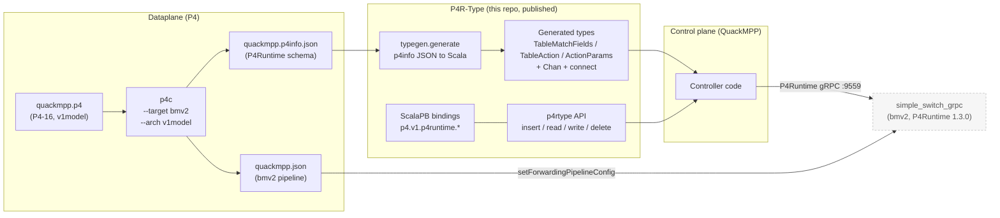
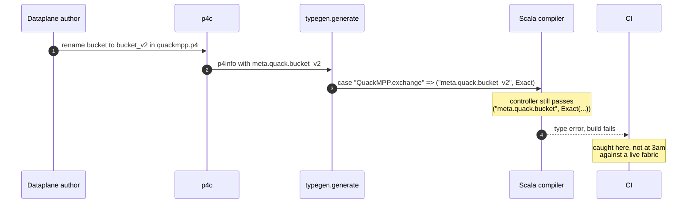
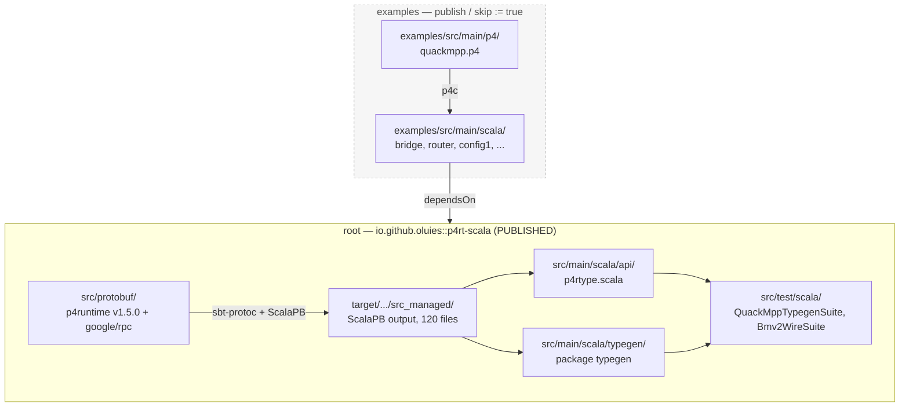
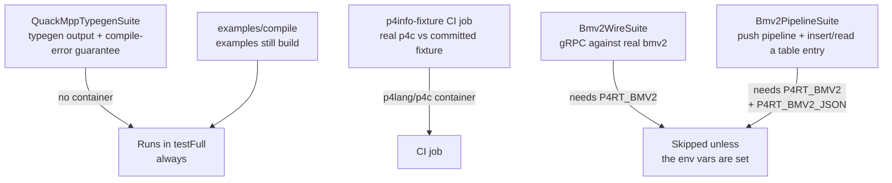

# P4R-Type architecture

How the pieces fit, and where the seams are. For the upgrade record and known
blockers see [UPGRADE.md](UPGRADE.md); for deferred work see [PROMPTS.md](PROMPTS.md).

---

## 1. The whole pipeline

P4R-Type sits between a P4 compiler and a P4 switch. Its one interesting claim is
that the **p4info file becomes Scala 3 types**, so a dataplane change that renames
a match field breaks the controller at *compile* time rather than at 3am.



Both edges into the switch are P4R-Type's now: `setForwardingPipelineConfig`
installs `quackmpp.json` + the p4info, and the `p4rtype` API writes table entries
over the same channel. (The mininet VM still loads its own pipelines out of band —
that predates the API having the capability.)

## 2. The guarantee QuackMPP spec 003 depends on

`typegen` turns each match-field name into a **singleton string type**. Renaming
`bucket` in the P4 therefore changes the *type*, and the controller stops
compiling — the failure moves from runtime to build time.



The emitted type for the fixture is exactly:

```scala
type TableMatchFields[TN] =
  TN match
    case "QuackMPP.exchange" => ("meta.quack.bucket", Exact) | "*"
    case "*" => "*"
```

Pinned by `QuackMppTypegenSuite`, which asserts both directions: the correct
snippet compiles, and a renamed field does not. A *control* test proves
`compileErrors` reports nothing for the valid snippet — without it, the negative
tests would pass even if the harness rejected everything.

### How the dependency is encoded: dependent method types

The match types above are only half the mechanism. They are *indexed by* a table
name, so something has to connect the index to the table name a caller actually
passed. That is `TableEntry.apply` in `src/main/scala/api/p4rtype.scala`:

```scala
def apply[TM[_], TA[_], TP[_]](
  table: String, matches: TM[table.type], action: TA[table.type],
  params: TP[action.type], priority: Int)
```

This is a **dependent method type**: the type of `matches` mentions `table.type`,
the singleton type of the *value* passed as `table`. Give it the literal
`"QuackMPP.exchange"` and `table.type` is that literal type, so `TM[table.type]`
reduces through the match type to `("meta.quack.bucket", Exact) | "*"`. The
argument list is checked against a type computed from an earlier argument's value.

Two consequences worth internalising before extending this:

  * **The chain is value → singleton type → match type → expected type.** It only
    works for literals. Pass a `val t: String = "QuackMPP.exchange"` without a
    singleton ascription and `table.type` widens to `String`, the match type gets
    stuck, and you get a confusing error rather than a useful one.
  * **`params` depends on `action`, not on `table`.** `TP[action.type]` is why an
    action's parameter list is checked against the action rather than the table —
    the same dependent-typing trick applied a second time, one argument later.

Scala 3 also offers [dependent *function* types](https://docs.scala-lang.org/scala3/book/types-dependent-function.html)
— the first-class `(k: Key) => Option[k.Value]` value form. They are a
generalisation of the dependent *method* types used here, letting such a signature
be a lambda stored in a `Map` or passed around. P4R-Type does not need that today:
entries are constructed at call sites, not built by combinators. Reach for them
only if a controller ever needs to abstract *over* tables — e.g. a generic
reconciler parameterised by table name — which is the case the method form cannot
express.

### The limits of the encoding

The generated types capture the *relational* structure of a p4info — which fields
belong to which table, which actions a table permits, which parameters an action
takes. They capture none of its *numeric* structure. `typegen` reads `matchType`
and never reads `bitwidth`, although the p4info carries it:

    "bitwidth": 16,  "matchType": "EXACT"   # meta.quack.bucket
    "bitwidth": 32                          # worker_id
    "bitwidth": 9                           # port

Note which half of that is a real hole. An over-long *encoding* is harmless:
`Exact(bytes(0, 0, 7))` on a `bit<16>` field is canonicalised to `bytes(7)` on
the way out (§7 gap 1), so the switch never sees it. What survives is an
over-large *value* — `bytes(2, 88)` is 600, which does not fit `bit<9>`, and no
amount of canonicalising shrinks it. Nothing in the types stops a controller
constructing that. For QuackMPP it is the one that matters: a bucket id
overflowing `bit<16>` is a silent misroute, not a crash.

`priority: Int` is likewise unconstrained even though the spec fixes it to 0 for
exact-only tables. Both are listed as gaps in §7.

There is a real cost to encoding more, and it is already visible. Renaming a match
field reports *"match type could not be fully reduced"* rather than naming the
field — the error surfaces downstream on `ActionParams`, not at the mistake. That
is why `QuackMppTypegenSuite` asserts only *that* compilation fails and never
matches on error text. Every additional fact pushed into match types makes those
messages worse, so weigh diagnostics against coverage rather than encoding
whatever the p4info happens to contain.

For where this sits relative to Π4, SafeP4 and the rest of the literature, see the
[README](README.md#related-work-and-what-else-the-types-could-check).

### Exact vs. non-exact matches

A wrinkle worth knowing before writing a controller: exact fields are mandatory in
P4Runtime, the others may be omitted. `typegen` mirrors that, so the shapes differ:

```scala
TableEntry(..., ("meta.quack.bucket", Exact(bytes(0,7))), ...)              // exact: bare tuple
TableEntry(..., Some("hdr.ipv4.dstAddr", LPM(bytes(10,0,1,1), 32)), ...)    // lpm: Option
```

## 3. Build layout

Two sbt projects. Only `root` is published; the split exists because the examples
used to ship inside the library jar, 35 of them in the **default package**.



Two traps encoded here, both learned the hard way:

- **`root` does NOT `.aggregate(examples)`.** Combined with
  `examples.dependsOn(root)` that hangs sbt 2 during project loading. CI names
  `examples/compile` explicitly instead.
- **`src/main/scala/protobuf/` no longer exists.** It used to hold 120 committed
  generated files, while `PB.protoSources` pointed at a directory that did not
  exist — so codegen produced nothing and the committed copies compiled. See
  [UPGRADE.md](UPGRADE.md) §2.

## 4. Testing: what is actually verified

Most of the suite is compile-and-typecheck. Two suites touch a real switch.



`Bmv2WireSuite` is what turns [UPGRADE.md](UPGRADE.md) §5 from an argument into a
measurement — bmv2 answers `p4runtime_api_version = 1.3.0`, confirming the switch
is pre-v1.4.0 and that a v1.5.0 client can still drive it.

`Bmv2PipelineSuite` (`container/p4rt.sh pipeline-test`) does the full loop that
`setForwardingPipelineConfig` made possible: install the pipeline, insert a
`bucket` entry through the generated types, read it back. It is also what found
the canonicalisation gap ([UPGRADE.md](UPGRADE.md) §8.12) — the kind of thing only
a real switch tells you.

That gap is now fixed on the write path, and pinned by tests in
`QuackMppTypegenSuite` that need no switch: unit tests for `canonical` itself,
plus one driving `Chan.toProto` end to end, which covers the action params
emitted by `typegen` as well as `matchFieldToProto`. (An earlier *tripwire* here
asserted the bug so it would fail when the fix landed; it was inverted when the
fix landed, and this paragraph described it for one commit longer than it
existed.)

Checking the write path is what needs no switch, and it is also all that can be
checked: a switch canonicalises whether or not P4R-Type does, so the read-back
value looks the same either way. See §7 gap 1 for what the fix does *not* cover.

## 5. Running the containers

The images are **linux/amd64 only** — `p4lang` publishes no arm64. That decides
the local-vs-CI split:

| | runtime | arch | notes |
| --- | --- | --- | --- |
| GitHub Actions | Docker (preinstalled) | amd64 native | `ubuntu-latest` is amd64; no emulation |
| macOS (Apple silicon) | Apple `container` or Docker | amd64 **emulated** | works, but first start took ~3m36s |

CI uses Docker because that is what the runners have; nothing in the repo depends
on that choice.

### Use `container/`

Apple's `container` has **no compose support** (`container compose` → *"Plugin
'container-compose' not found"*), so there are two entry points rather than one:

| | works with |
| --- | --- |
| `container/p4rt.sh` | Apple `container` **and** Docker (auto-detects; `RUNTIME=` to force) |
| `container/compose.yaml` | Docker only |

```bash
container/p4rt.sh up        # bmv2 on localhost:9559, waits until it answers
container/p4rt.sh test           # up + run Bmv2WireSuite against it
container/p4rt.sh pipeline-test  # up + push a pipeline + insert/read a table entry
container/p4rt.sh gen       # regenerate the p4info fixture with current p4c
container/p4rt.sh gen-vm    # ...with the p4c line the mininet VM ships (§6)
container/p4rt.sh down
```

or, on Docker:

```bash
docker compose -f container/compose.yaml up -d bmv2
docker compose -f container/compose.yaml --profile tools run --rm p4c
```

The script handles the daemon start, the platform flag, and the readiness poll.
If you drive the runtime by hand instead, the three traps below are the ones that
cost real time.

Three things that will cost you an hour otherwise:

1. **Connect to `localhost:9559`, not the IP `container ls` prints.** That IP is
   not routable from the macOS host, and it changes across restarts.
2. **`--` before `--grpc-server-addr`.** bmv2's target parser is separate from its
   general options; without it the container starts, prints usage, and dies — and
   the published port still answers, so `nc -z` says "open" for a service that is
   not there.
3. **sbt's server outlives your shell.** `Test / fork := false`, so an `export
   P4RT_BMV2=...` after sbt is already running never reaches the test. Run
   `sbt shutdown` first.

## 6. `vm/` vs `container/` — are they the same thing?

**No.** Worth being explicit, because it is easy to assume the container is "the
VM, but faster". It is not, and neither one has been changed by this upgrade —
`vm/` is exactly as the OOPSLA artifact left it.

| | `vm/` (Vagrant + VirtualBox) | `container/` (Docker / Apple `container`) |
| --- | --- | --- |
| OS | Ubuntu 20.04 (`bento/ubuntu-20.04`) | Ubuntu 20.04.6 (image base) |
| bmv2 | `p4lang-bmv2` **1.15.0-9** | **1.15.4** |
| p4c | `p4lang-p4c` **1.2.4.2-2** | **1.2.5.15** |
| PI | `p4lang-pi` 0.1.0-15 | (in the bmv2 image) |
| mininet | yes — pinned to `aa0176f` (2022-04-02) | **no** |
| topology | 4 switches `s1`..`s4` + hosts, `config1`/`config2` loaded | **none** — one bare switch, `--no-p4` |
| P4 programs | `vm/files/config1.p4`, `config2.p4`, … | `examples/src/main/p4/quackmpp.p4` |
| use | run the paper's examples end-to-end | regenerate the p4info fixture; exercise the P4Runtime wire |

The VM installs its P4 stack from the openSUSE build service repo
(`home:p4lang/xUbuntu_20.04`), which **still resolves** — `vagrant up` is not
broken by bit-rot as of this writing. Those packages are what pins it to p4c
1.2.4.2 / bmv2 1.15.0.

### The version skew, and why it does not bite

The gap that matters is **p4c 1.2.4.2 (VM) vs 1.2.5.15 (container)**, because the
committed p4info fixture is generated by the latter. They do not agree:

```console
$ container/p4rt.sh gen-vm     # p4c 1.2.4.3, the VM's line
-   "initialDefaultAction": {
-    "actionId": 21257015
-   },
```

VM-era p4c does **not** emit `initialDefaultAction`; modern p4c does. So the
fixture is not byte-representative of what the VM's p4c produces.

It does not reach the generated types, though — verified rather than assumed:
running `typegen` over both p4infos produces **byte-identical Scala** (same md5).
`initialDefaultAction` is simply a field typegen ignores. So a controller built
against the fixture is valid for a VM-generated p4info of the same P4 program.

bmv2 1.15.0 vs 1.15.4 is a patch-level gap on the same minor, and
`Bmv2WireSuite` measures what actually matters — the container's bmv2 reports
`p4runtime_api_version = 1.3.0`, which is the same pre-v1.4.0 P4Runtime the VM's
PI 0.1.0 provides ([UPGRADE.md](UPGRADE.md) §5).

### Which to use

- **`container/`** for anything about *types and the wire*: regenerating the
  fixture, `Bmv2WireSuite`, CI. Seconds to start, no VirtualBox.
- **`vm/`** for anything about *packets*: the README's examples, mininet
  topology, `send.py`/`receive.py`. The container has no network to speak of.

Neither has been upgraded. The VM still works; if it is ever refreshed, note that
`home:p4lang` also publishes `xUbuntu_22.04` and `Debian_11`.

## 7. Known architectural gaps

1. ~~**No `SetForwardingPipelineConfig`.**~~ Added — `setForwardingPipelineConfig`
   / `getForwardingPipelineConfig`, verified against a real bmv2 by
   `Bmv2PipelineSuite` (`container/p4rt.sh pipeline-test`), which pushes a
   pipeline, inserts a `bucket` entry and reads it back.

   But note the gap it exposed: **P4R-Type does not canonicalise binary strings**,
   so `write` then `read` does not round-trip a value. This is **half closed**, and
   an earlier revision of this list struck it out entirely — an overclaim, corrected
   here.

   `p4rtype.canonical` strips leading zero bytes on the way out, in both halves of
   the write path (`matchFieldToProto`, and the action params emitted by `typegen`),
   so **the wire is conformant**. It is not applied on the way in: `fromProto`
   returns the switch's bytes verbatim, and the caller's `TableEntry` still holds
   whatever they built. Write an `Exact(bytes(0, 7))`, read back an
   `Exact(bytes(7))`, and those are unequal in Scala — so a controller diffing
   observed state against intent still sees a phantom change unless it runs its own
   intent through `p4rtype.canonical` first (public for exactly that reason).

   **Open decision.** Closing this at the API level means canonicalising at
   construction, in the `Exact` / `LPM` / `Range` / `Ternary` / `Optional`
   companions. That is a behavioural change to published types — `Exact(bytes(0,7))`
   would then `==` `Exact(bytes(7))`, which is the point — and it only covers match
   fields: action params are bare `ByteString`s inside generated tuples and cannot
   be intercepted, so that half needs the caller's cooperation regardless. Worth
   deciding before QuackMPP builds reconciliation on `read`.
   [UPGRADE.md](UPGRADE.md) §8.12.
2. **No multicast or clone-session modelling.** `Replica`, `MulticastGroupEntry`
   and `CloneSessionEntry` exist in the generated bindings but not in the
   `p4rtype` API. An MPP fabric replicating across workers builds on
   `p4.v1.p4runtime.*` directly — and must use the *deprecated* `egress_port` arm
   of `Replica`'s oneof, because bmv2 is 1.3.0 ([UPGRADE.md](UPGRADE.md) §5).
3. **Single primary controller.** `connect` hardcodes election id
   `Uint128(high = 0, low = 1)`; role-based arbitration is not modelled.
4. **`typegen` output is per-p4info and belongs to the consumer.** It writes Scala
   source; the consumer compiles it into its own module. P4R-Type ships the
   mechanism, not anyone's types.
5. **Bitwidths are not typed.** `typegen` discards `bitwidth` (§2, *The limits of
   the encoding*), so an over-large *value* for a field reaches the switch before
   anything objects: a `bit<9>` port accepts 600 at compile time. Note this is
   about magnitude, not encoding length — an over-long encoding is canonicalised
   away by gap 1 and never reaches the switch, so a length check on the literal
   `bytes(...)` would reject harmless input (`bytes(0,0,7)`) while still missing
   the real case (`bytes(2, 88)` into a `bit<9>`). The meaningful check compares
   `canonical(...)`'s length, and the significant bits of its top byte, against
   the field's bitwidth.
6. **`priority` is an unconstrained `Int`.** P4Runtime requires 0 for tables whose
   fields are all exact, and nonzero where a ternary/range/optional field is
   present. The p4info knows the match kinds, so this is derivable; today a wrong
   priority is a runtime rejection.

   The repo violates its own rule here: `QuackMppTypegenSuite` builds a
   `QuackMPP.exchange` entry (exact-only) with `priority = 1`, while
   `Bmv2PipelineSuite` correctly uses `0`. It is harmless — those entries are
   constructed to check types and never sent to a switch — and it is left as is
   deliberately: asserting `priority = 1` round-trips proves the field is threaded
   through, whereas asserting `0` would still pass if `priority` were dropped
   entirely. Typing this would break that test, which is the warning worth having
   recorded rather than the test worth weakening.
7. **Only tables are typed.** `CounterEntry(counter_id: Int, ...)` is a bare
   integer — no name-based safety, nothing generated from the p4info. The same is
   true of meters and digests. This is the guarantee the paper establishes for
   tables, simply not extended to the other entity kinds; an MPP fabric wanting
   per-bucket counters hits it immediately.
8. **The read path is cast-based.** `fromProto` in the generated code is a
   sequence of `asInstanceOf` calls (see `src/test/scala/quackmpp_exchange.scala`).
   The guarantee is genuinely a *write-path* guarantee — reads are dynamically
   typed and merely do not crash. Relevant to anyone building state reconciliation
   on top of `read`.
