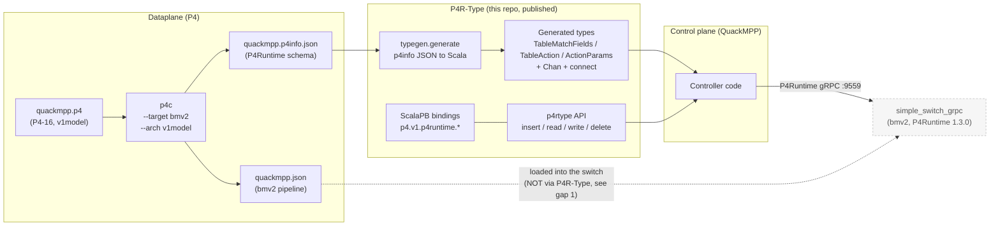
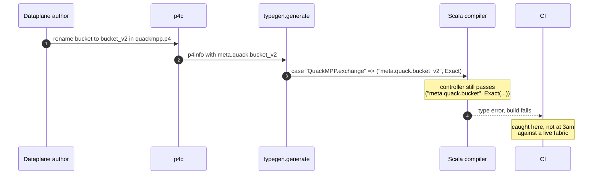
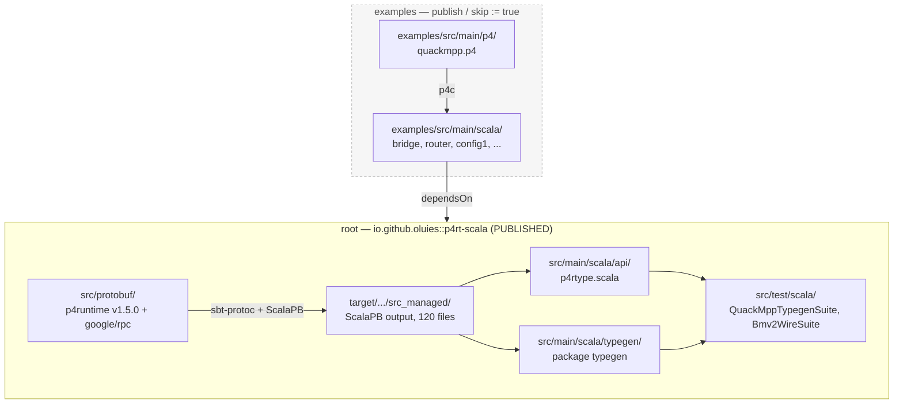
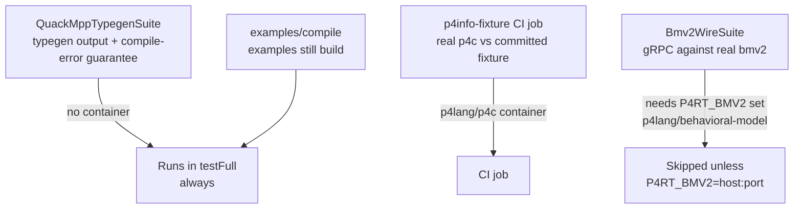

# P4R-Type architecture

How the pieces fit, and where the seams are. For the upgrade record and known
blockers see [UPGRADE.md](UPGRADE.md); for deferred work see [PROMPTS.md](PROMPTS.md).

---

## 1. The whole pipeline

P4R-Type sits between a P4 compiler and a P4 switch. Its one interesting claim is
that the **p4info file becomes Scala 3 types**, so a dataplane change that renames
a match field breaks the controller at *compile* time rather than at 3am.



The dotted edge is the first architectural gap: **P4R-Type has no
`SetForwardingPipelineConfig`**, so it cannot install a pipeline. Something else
must load `quackmpp.json` into the switch (the mininet VM does this out of band).

## 2. The guarantee QuackMPP spec 003 depends on

`typegen` turns each match-field name into a **singleton string type**. Renaming
`bucket` in the P4 therefore changes the *type*, and the controller stops
compiling — the failure moves from runtime to build time.



The emitted type for the fixture is exactly:

```scala
type TableMatchFields[TN] =
  TN match
    case "QuackMPP.exchange" => ("meta.quack.bucket", Exact) | "*"
    case "*" => "*"
```

Pinned by `QuackMppTypegenSuite`, which asserts both directions: the correct
snippet compiles, and a renamed field does not. A *control* test proves
`compileErrors` reports nothing for the valid snippet — without it, the negative
tests would pass even if the harness rejected everything.

### Exact vs. non-exact matches

A wrinkle worth knowing before writing a controller: exact fields are mandatory in
P4Runtime, the others may be omitted. `typegen` mirrors that, so the shapes differ:

```scala
TableEntry(..., ("meta.quack.bucket", Exact(bytes(0,7))), ...)              // exact: bare tuple
TableEntry(..., Some("hdr.ipv4.dstAddr", LPM(bytes(10,0,1,1), 32)), ...)    // lpm: Option
```

## 3. Build layout

Two sbt projects. Only `root` is published; the split exists because the examples
used to ship inside the library jar, 35 of them in the **default package**.



Two traps encoded here, both learned the hard way:

- **`root` does NOT `.aggregate(examples)`.** Combined with
  `examples.dependsOn(root)` that hangs sbt 2 during project loading. CI names
  `examples/compile` explicitly instead.
- **`src/main/scala/protobuf/` no longer exists.** It used to hold 120 committed
  generated files, while `PB.protoSources` pointed at a directory that did not
  exist — so codegen produced nothing and the committed copies compiled. See
  [UPGRADE.md](UPGRADE.md) §2.

## 4. Testing: what is actually verified

Most of the suite is compile-and-typecheck. Only `Bmv2WireSuite` touches a wire.



`Bmv2WireSuite` is what turns [UPGRADE.md](UPGRADE.md) §5 from an argument into a
measurement — bmv2 answers `p4runtime_api_version = 1.3.0`, confirming the switch
is pre-v1.4.0 and that a v1.5.0 client can still drive it.

## 5. Running the containers

The images are **linux/amd64 only** — `p4lang` publishes no arm64. That decides
the local-vs-CI split:

| | runtime | arch | notes |
| --- | --- | --- | --- |
| GitHub Actions | Docker (preinstalled) | amd64 native | `ubuntu-latest` is amd64; no emulation |
| macOS (Apple silicon) | Apple `container` or Docker | amd64 **emulated** | works, but first start took ~3m36s |

CI uses Docker because that is what the runners have; nothing in the repo depends
on that choice.

### Use `container/`

Apple's `container` has **no compose support** (`container compose` → *"Plugin
'container-compose' not found"*), so there are two entry points rather than one:

| | works with |
| --- | --- |
| `container/p4rt.sh` | Apple `container` **and** Docker (auto-detects; `RUNTIME=` to force) |
| `container/compose.yaml` | Docker only |

```bash
container/p4rt.sh up        # bmv2 on localhost:9559, waits until it answers
container/p4rt.sh test      # up + run Bmv2WireSuite against it
container/p4rt.sh gen       # regenerate the p4info fixture with current p4c
container/p4rt.sh gen-vm    # ...with the p4c line the mininet VM ships (§6)
container/p4rt.sh down
```

or, on Docker:

```bash
docker compose -f container/compose.yaml up -d bmv2
docker compose -f container/compose.yaml --profile tools run --rm p4c
```

The script handles the daemon start, the platform flag, and the readiness poll.
If you drive the runtime by hand instead, the three traps below are the ones that
cost real time.

Three things that will cost you an hour otherwise:

1. **Connect to `localhost:9559`, not the IP `container ls` prints.** That IP is
   not routable from the macOS host, and it changes across restarts.
2. **`--` before `--grpc-server-addr`.** bmv2's target parser is separate from its
   general options; without it the container starts, prints usage, and dies — and
   the published port still answers, so `nc -z` says "open" for a service that is
   not there.
3. **sbt's server outlives your shell.** `Test / fork := false`, so an `export
   P4RT_BMV2=...` after sbt is already running never reaches the test. Run
   `sbt shutdown` first.

## 6. `vm/` vs `container/` — are they the same thing?

**No.** Worth being explicit, because it is easy to assume the container is "the
VM, but faster". It is not, and neither one has been changed by this upgrade —
`vm/` is exactly as the OOPSLA artifact left it.

| | `vm/` (Vagrant + VirtualBox) | `container/` (Docker / Apple `container`) |
| --- | --- | --- |
| OS | Ubuntu 20.04 (`bento/ubuntu-20.04`) | Ubuntu 20.04.6 (image base) |
| bmv2 | `p4lang-bmv2` **1.15.0-9** | **1.15.4** |
| p4c | `p4lang-p4c` **1.2.4.2-2** | **1.2.5.15** |
| PI | `p4lang-pi` 0.1.0-15 | (in the bmv2 image) |
| mininet | yes — pinned to `aa0176f` (2022-04-02) | **no** |
| topology | 4 switches `s1`..`s4` + hosts, `config1`/`config2` loaded | **none** — one bare switch, `--no-p4` |
| P4 programs | `vm/files/config1.p4`, `config2.p4`, … | `examples/src/main/p4/quackmpp.p4` |
| use | run the paper's examples end-to-end | regenerate the p4info fixture; exercise the P4Runtime wire |

The VM installs its P4 stack from the openSUSE build service repo
(`home:p4lang/xUbuntu_20.04`), which **still resolves** — `vagrant up` is not
broken by bit-rot as of this writing. Those packages are what pins it to p4c
1.2.4.2 / bmv2 1.15.0.

### The version skew, and why it does not bite

The gap that matters is **p4c 1.2.4.2 (VM) vs 1.2.5.15 (container)**, because the
committed p4info fixture is generated by the latter. They do not agree:

```console
$ container/p4rt.sh gen-vm     # p4c 1.2.4.3, the VM's line
-   "initialDefaultAction": {
-    "actionId": 21257015
-   },
```

VM-era p4c does **not** emit `initialDefaultAction`; modern p4c does. So the
fixture is not byte-representative of what the VM's p4c produces.

It does not reach the generated types, though — verified rather than assumed:
running `typegen` over both p4infos produces **byte-identical Scala** (same md5).
`initialDefaultAction` is simply a field typegen ignores. So a controller built
against the fixture is valid for a VM-generated p4info of the same P4 program.

bmv2 1.15.0 vs 1.15.4 is a patch-level gap on the same minor, and
`Bmv2WireSuite` measures what actually matters — the container's bmv2 reports
`p4runtime_api_version = 1.3.0`, which is the same pre-v1.4.0 P4Runtime the VM's
PI 0.1.0 provides ([UPGRADE.md](UPGRADE.md) §5).

### Which to use

- **`container/`** for anything about *types and the wire*: regenerating the
  fixture, `Bmv2WireSuite`, CI. Seconds to start, no VirtualBox.
- **`vm/`** for anything about *packets*: the README's examples, mininet
  topology, `send.py`/`receive.py`. The container has no network to speak of.

Neither has been upgraded. The VM still works; if it is ever refreshed, note that
`home:p4lang` also publishes `xUbuntu_22.04` and `Debian_11`.

## 7. Known architectural gaps

1. **No `SetForwardingPipelineConfig`.** The API is connect / insert / read /
   write / delete only, so P4R-Type cannot install a pipeline — something else has
   to. QuackMPP's spec 003 regenerates types after a p4info change; deploying that
   change needs a capability this library does not have.
2. **No multicast or clone-session modelling.** `Replica`, `MulticastGroupEntry`
   and `CloneSessionEntry` exist in the generated bindings but not in the
   `p4rtype` API. An MPP fabric replicating across workers builds on
   `p4.v1.p4runtime.*` directly — and must use the *deprecated* `egress_port` arm
   of `Replica`'s oneof, because bmv2 is 1.3.0 ([UPGRADE.md](UPGRADE.md) §5).
3. **Single primary controller.** `connect` hardcodes election id
   `Uint128(high = 0, low = 1)`; role-based arbitration is not modelled.
4. **`typegen` output is per-p4info and belongs to the consumer.** It writes Scala
   source; the consumer compiles it into its own module. P4R-Type ships the
   mechanism, not anyone's types.
